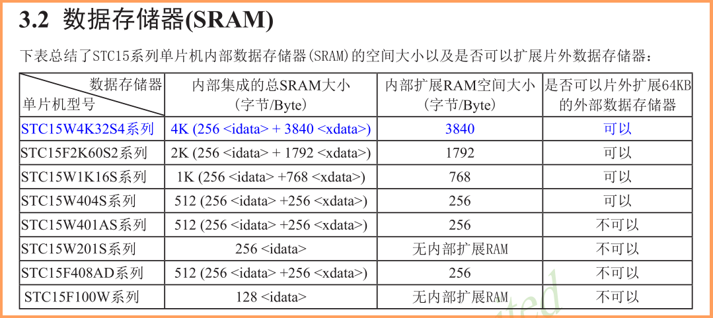

# 开发随记
**注意**，本文档中所有涉及到的代码均在文件Colors.C编写。 

###### 工程相关
    项目名称 : Colors
    编程平台 ：Keil uVision4 V9.02
    操作系统 ：Win7 | Win10
    晶振频率 ：内部24.000MHZ
    MCU 型号 ：STC15W10x/STC15F10xW/STC15W20xS
    设 计 者 : biu~
    版 本 号 : v1.008
    模板版本 : v0.027

## 前期开发
整体来讲前期构造了五个函数，包括： 
1. PWM输出功能实现：`TimerPWM();`以中断溢出为周期进行调用；
1. PWM输出值调整：`TimerPWM_Duty_Add();`，`TimerPWM_Duty_Dec();`；
1. LED色彩流转主框架，包括`Con_TimerPWM_Duty_Slow();`慢速变换及`Con_TimerPWM_Duty_Fast();`快速变换，二者之间的切换由bit型变量*conSpeed*进行控制；

## 后期完善
后期进行的工作：调Bug，具体来讲就是想办法把前期开发中已经发现的问题想办法解决掉，**并愉快的写下新的Bug**（笑）。 
在前期最明显的问题在于部分情况下LED会有颜色闪动，运行到某些特定的地方LED亮度会突然变高然后很快恢复正常，以个人经验来看——猜。 

### date:2018/04/19
#### 问题处理：PWM占空为0时LED未完全关闭
是的没错，虽然主要问题没能解决，但用上新设计的[MiniComBo](. "MiniComBo开发板")发现了这个问题。 
很明显是在*TimerPWM()*里出了问题，仔细看了看发觉问题在于代码段： 

    if(++temp_pwm_duty == PWM_DUTY_MAX)     //PWM周期结束，重新开始新的周期
    {
        temp_pwm_duty = 0;
        Color_Blue = PWM_ON;
        Color_Green = PWM_ON;
        Color_Red = PWM_ON;
    }

所以无论占空设置是否为0，LED都会被打开，即使是一瞬间（其实是一个定时器溢出周期）。 
虽然以前也犯过同样的错误，但似乎印象不是特别深刻的呢。——快停下，别丢人了。 

    if(++temp_pwm_duty == PWM_DUTY_MAX)     //PWM周期结束，重新开始新的周期
    {
        temp_pwm_duty = 0;
        if (PwmDuty[PWM_BLUE] != 0)         //在PWM占空为0时不开启灯光；
            Color_Blue = PWM_ON;
        if (PwmDuty[PWM_Green] != 0)
            Color_Green = PWM_ON;
        if (PwmDuty[PWM_Red] != 0)
            Color_Red = PWM_ON;
    }

然后今天（其实是昨天）愉快的结束了~ 
咕咕真舒服.jpg 

### date:2018/04/20
#### 关于“PWM占空为0时LED未完全关闭”的二次修改

作为一个一丝不苟的人，本人认为昨天那样修改不合适。 

    if (PwmDuty[PWM_BLUE] != 0)         //在PWM占空为0时不开启灯光；
        Color_Blue = PWM_ON;

这种判断格式明显是读出数组中的值后，跟一个立即数#0进行比较判断，肯定没有这样写节省时钟周期呀~ 

    //  if (PwmDuty[PWM_BLUE] != 0)         //在PWM占空为0时不开启灯光；
        if (!PwmDuty[PWM_BLUE])             //在PWM占空为0时不开启灯光；
            Color_Blue = PWM_ON;

~~当数组中的值非真时（即为假(0)）将PWM输出打开。~~ 
之后的十分钟里，就变成了自己无论如何也想不明白“蓝灯为什么不会亮？”。 
幸好在最后关头想起了Keil的调试工具（默认快捷键Ctrl+F5打开），所以直接开启后直接找到了经过编译器解释的对应的汇编语句： 
用*if (PwmDuty[PWM_BLUE] != 0)*时： 

        44:         if (PwmDuty[PWM_BLUE] != 0) 
        45: //        if (!PwmDuty[PWM_BLUE])           //在PWM占空为0时不开启灯光； 
    C:0x04A7    E519     MOV      A,PwmDuty(0x19)
    C:0x04A9    6002     JZ       C:04AD

用*if (!PwmDuty[PWM_BLUE])*时： 

        44: //        if (PwmDuty[PWM_BLUE] != 0)
        45:         if (!PwmDuty[PWM_BLUE])           //在PWM占空为0时不开启灯光； 
    C:0x04A7    E519     MOV      A,PwmDuty(0x19)
    C:0x04A9    7002     JNZ      C:04AD

可以看到第一个跳转条件为**JZ**（累加器ACC为0时跳转），第二个为**JNZ**（非0时跳转）；尽管如此，仍有那么几个瞬间在怀疑是编译器的问题... 
洗洗睡吧，别丢人了。  
但有一点需要注意的是，**修改源代码后不要忘记build一下**（F7），不然如图所示： 

#### 关于if中的相等/不等式判断
在搞明白值后，发觉为什么*if (PwmDuty[PWM_BLUE] != 0)*不是用数组与立即数相比较？ 
所以，测试一下： 

        44:         if (PwmDuty[PWM_BLUE] != 1)
        45: //        if (!PwmDuty[PWM_BLUE])           //在PWM占空为0时不开启灯光； 
    C:0x04A7    E519     MOV      A,PwmDuty(0x19)
    C:0x04A9    6401     XRL      A,#0x01
    C:0x04AB    6002     JZ       C:04AF

编译器还真是善解人意呢。 
觉得如果自己是日本人，Keil编译器的**娘化**指日可待呀。（幸好不是） 
##### 结论（重点）
那么，以后判断一个量是否等于零时，以后就不再用`if(!variable)`或是`if(variable)`了，写作`if(variable == 0)`或是`if(variable != 0)`更清晰并且编译器解释出的语句也是一样的，完美。 
##### 还有一点小问题

    #define PWM_BLUE    0
    #define PWM_GREEN   1
    #define PWM_RED     2

define在编译器眼中不是直接替换的吗？那为什么编译之后： 
    
        44:         if (PwmDuty[PWM_BLUE] != 0) 
    C:0x04A7    E519     MOV      A,PwmDuty(0x19)
    C:0x04A9    6002     JZ       C:04AD

*PwmDuty(0x19)*？ 

#### 关于STC15F10xW/STC15W10x/STC15W20xS内部SRAM
既然考虑到运行效率，让人不由得想到：不是把常用变量直接定义在RAM里效率更高吗？于是： 

    //u8 PwmDuty[3];
    xdata u8 PwmDuty[3];

嘿嘿，说不定LED颜色闪动的问题也就就此解决了呢。 
然而LED又不亮了？。  

没有xdata，尝试改用idata。  
LED开始不正常的爆闪。 
没办法，试试直接定义到data？ 
终于正常了，然而LED颜色闪动的问题依旧存在。 

#### 终于，开始研究最初的问题
果然调试就是为了写新Bug。  
第一步，用*while(1)*找到出问题的代码段。 

    case 5: if(TimerPWM_Duty_Add(PWM_RED, 255) && TimerPWM_Duty_Add(PWM_BLUE, 230)) {mode ++;}
        break;
    case 6: if(TimerPWM_Duty_Dec(PWM_RED, 0) && TimerPWM_Duty_Dec(PWM_GREEN, 0) && TimerPWM_Duty_Dec(PWM_BLUE, 0)) {while(1);mode ++;}
        break;                                                                                                      

经过仔细排查，确认第一次发生颜色闪动是在执行*case 6*的过程中，在*case 6*运行过程中山东了两次。  
第二步，确认；直接*mode = 5;*，确认闪动的确是在*case 6*。 
这个时候问题就来了，LED不再有颜色闪动了，intersting。 
最终确认出问题的位置就是在这儿，但是必须从头开始运行。所以，似乎不是程序的问题，是运行过程中内存被分配完了吧？（后期调试开始时也在一直考虑这个问题，所以回去想要改进经常被执行的代码段的运行效率）MCU IO的驱动能力不足？（前期开发过程中确实发现*15F104W*的驱动能力不如*15W204S*）  
第三步，尝试使用*15F2K60S2*，没什么用，同样的位置闪动。  
第四步，重新观察，确认闪动时突然变亮的颜色为红色（其实不确定），问题代码跟*case 0* ~ *case 5*最大的区别是调用了三个函数；但在快速变换中也有同时调用三个的，未发生颜色闪动的问题。 
观察发现在执行*case 6*前绿色的占空已经为0，尝试去除*PWM_GREEN*控制语句，但仍然在相同的地方闪动两次。  
第五步，观察在*case 6*运行前PWM占空比RED>BLUE>GREEN，尝试将*case 6*修改为： 

    case 6: if(TimerPWM_Duty_Dec(PWM_GREEN, 0) && TimerPWM_Duty_Dec(PWM_BLUE, 0) && TimerPWM_Duty_Dec(PWM_RED, 0)) {while(1); mode ++;}
        break;                                                                                                      

第一次循环闪烁现象消失，第二次循环再次出现。  
第六步，尝试将LED亮度变化由折线形式转变为直线形式，闪烁问题加剧。  
今天到此为止，先放一下。 

#### if中的多个判断条件的执行结构
`if(condition1 && condition2 && condition3 && ...)`这样一个程序语句的执行方式是怎样的呢？ 
在之前的个人理解中，因if后方的判断条件有两种情况，程序会将判断条件中的每一个条件都执行一遍，然后再根据逻辑运算符来确定最终是否进入if条件下的语句；然而经过本次较为深入的探究后，发觉并不是。 
依旧用上方*case 6*作为例子： 

       134:             case 6: if(TimerPWM_Duty_Dec(PWM_GREEN, 0) && TimerPWM_Duty_Dec(PWM_BLUE, 0) && TimerPWM_Duty_Dec(PWM_RED, 0)) {mode ++;} 
    C:0x00BE    E4       CLR      A
    C:0x00BF    FD       MOV      R5,A
    C:0x00C0    7F01     MOV      R7,#0x01
    C:0x00C2    120425   LCALL    TimerPWM_Duty_Dec(C:0425)
    C:0x00C5    4003     JC       C:00CA
    C:0x00C7    0201AF   LJMP     C:01AF
    C:0x00CA    1F       DEC      R7
    C:0x00CB    120425   LCALL    TimerPWM_Duty_Dec(C:0425)
    C:0x00CE    4003     JC       C:00D3
    C:0x00D0    0201AF   LJMP     C:01AF
    C:0x00D3    7F02     MOV      R7,#0x02
    C:0x00D5    120425   LCALL    TimerPWM_Duty_Dec(C:0425)
    C:0x00D8    4003     JC       C:00DD
    C:0x00DA    0201AF   LJMP     C:01AF
    C:0x00DD    0516     INC      0x16
       135:                 break;                                                                                                       
    C:0x00DF    22       RET      

主要分析这几行： 

    C:0x00BE    E4       CLR      A
    C:0x00BF    FD       MOV      R5,A
    C:0x00C0    7F01     MOV      R7,#0x01
    C:0x00C2    120425   LCALL    TimerPWM_Duty_Dec(C:0425)
    C:0x00C5    4003     JC       C:00CA
    C:0x00C7    0201AF   LJMP     C:01AF

编译器将函数`TimerPWM_Duty_Dec(PWM_GREEN, 0)`的两个参数分别装入R5与R7，然后跳转至子函数，**JC**即”进位为1则转移“，可以猜想函数返回值被编译器装入进位标志，当if的第一个判断条件为1时，才**JC**跳转到第二个判断条件；否则执行**LJMP**，直接跳转到if语句之外。 
因而*case 6*在逻辑关系上相当于： 

    case 6:     if (TimerPWM_Duty_Dec(PWM_GREEN, 0))
                    if (TimerPWM_Duty_Dec(PWM_BLUE, 0))
                        if (TimerPWM_Duty_Dec(PWM_BLUE, 0)){mode ++;}
        break;

不过，人们创造编译器的目的就是让他能够更高效更优秀的翻译高级程序语言，倒是我自己，把Ta当作不会变通的机器了。 
编译器的善解人意还真是一丝不苟呢。 
所以，想要实现原本预计的可以三种颜色一起变化，现在不得不修改一下程序结构了；单独改变一种颜色的亮度可以依旧使用原调用方式，多种颜色同时改变需要新建立一个函数。 

    #define DEC 0
    #define ADD 1

    #define BLUE_RED    1
    #define BLUE_GREEN  2
    #define RED_GREEN   3
    /* *******************************************************************************************
    // 多（双）颜色亮度控制
    /* ******************************************************************************************* */
    static bit conColorsPWM(u8 colors, bit color1_dec_or_inc, u8 temp_color1, bit color2_dec_or_inc, u8 temp_color2)
    {
        auto u8 count = 0;
        switch (colors)
        {
            case BLUE_RED:
            {
                if ((color1_dec_or_inc == DEC) ? TimerPWM_Duty_Dec(PWM_BLUE, temp_color1) : TimerPWM_Duty_Add(PWM_BLUE, temp_color1))
                {
                    count ++;
                }
                if ((color2_dec_or_inc == DEC) ? TimerPWM_Duty_Dec(PWM_RED, temp_color2) : TimerPWM_Duty_Add(PWM_RED, temp_color2))
                {
                    count ++;
                }
            }
                break;
            case BLUE_GREEN:
            {
                if ((color1_dec_or_inc == DEC) ? TimerPWM_Duty_Dec(PWM_BLUE, temp_color1) : TimerPWM_Duty_Add(PWM_BLUE, temp_color1))
                {
                    count ++;
                }
                ......
            }
            case RED_GREEN:
            .....
                break;
            default:
                break;
        }
        return ((count == 2) ? 1 : 0);
    }

让条件表达式来的更猛烈些吧。（其实原来的颜色变换设置不适合同时变换，颜色巨丑——但今天到此结束。） 

### date:2018/04/21
由于一时疏忽把上一版本的程序源码弄丢了，oRZ. 
所以飞速的将昨天修改过的源码备份了一遍。  
新现象：绿色LED占空250左右，红色降至190仍显色，降至180直接熄灭。 

### date:2018/04/22
添加定时器延时相关代码段，修改部分返回值为*TRUE*or*FALSE*；颜色变化结构重新编写，并添加注释；（V1.004）  
亮度控制常量由确切的值修改为以*PWM_DUTY_MAX*为基准的运算关系式，如*PWM_DUTY_MAX/3*或*PWM_DUTY_MAX/3x2*，这样再修改PWM周期后不会影响到程序的正常运行；（V1.005）  
一种Colors控制模式。（V1.006）（版本备份）  

### date:2018/04/22
尝试修改定时器中断溢出周期、PWM周期、定义关键函数所使用的寄存器组，均未能解决闪动问题； 
移除与程序运行无关的代码段，并调整部分代码。（V1.007）  
现象：闪动一般发生在亮度下降阶段； 
考虑目前所得到的线索，问题出在中断频率的可能性最大，但同样也有几点现象可反驳此观点；  
找到问题原因： 
    
    //    if(temp_pwm_duty == PwmDuty[PWM_BLUE]) Color_Blue = PWM_OFF;       //判断PWM占空比是否结束；
        if(temp_pwm_duty >= PwmDuty[PWM_BLUE]) Color_Blue = PWM_OFF;       //判断PWM占空比是否结束；
    ......

考虑问题产生原因：**如果由一两个PWM周期占空为100%就会产生此现象**，重新检查PWM输出控制代码，将原判断条件**==**修改为**>=**，即可。（V1.008）（版本备份） 
由于PWM输出函数是由STC-ISP中的范例程序*使用定时器0做16路软件PWM*修改而来的，而且之前多次使用，此次并未对此部分代码仔细分析； 
但从另一方面来讲，以前用到时也很少会有如此直观的观察到问题出现的机会。还行（笑） 
## 已备份版本
* V1.003---------------ID:d28c9a3
* V1.006---------------ID:ba22bec
* V1.008---------------当前版本
## 文档相关
    Edit:       Notepad++ 
    Preview:    Moeditor
    Language:   Markdown & HTML
    Encoding:   UTF-8
    Edits:      8

