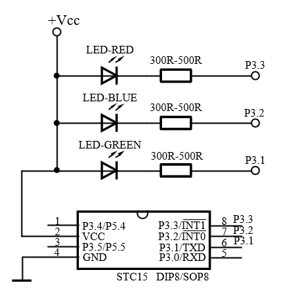

# Colors

#### 开发环境：
    Source program：*Keil uVision4 V9.02*
    Schematic：*Microsoft Visio 2016 MSO*

## 文件链接

- 编程历程记录[开发随记](./Documents/开发随记.md "开发随记")
- 了解文件变量函数等的命名方式[命名方式](./Documents/命名方式.md "命名方式")
- 需要了解了解工程内文件各自的功能定义，请参阅[工程说明](./Documents/工程说明.md "工程说明")

## 功能概述

利用多路PWM控制LED的色彩变换。

## 制作
#### 一、原理图：
  

    Edit:       Notepad++ 
    Preview:    Moeditor
    Language:   Markdown & HTML
    Last-Edit:  2018/04/20
    Edits:      3